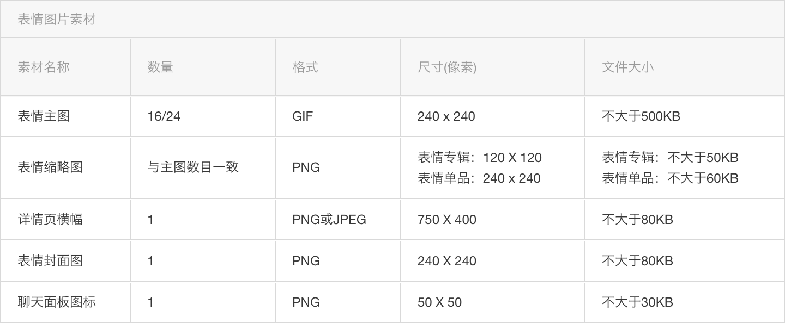

# Sindy's Adobe Illustrator Scripts

Author: Qinye Li (qinyeli@umich.edu)  
Last updated: Dec, 2019

This is a set of scripts I wrote to automate my first WeChat Sticker creation. It saved me from the tedius manual labor of processing tens of stickers w.r.t the specific requirements by WeChat.

## WeChat Sticker specifications

The [WeChat 表情开放平台](https://sticker.weixin.qq.com/) has some specific requirements on the size / file format of the stickers and their tumbnails.

Specifically, they require

* a set of WeChat stickers to include 16 or 24 stickers,
* where each sticker is a **240x240px GIF**
* and each sticker has a corresponding **120x120px PNG** thumbnail.

Another info I had from the community was that

* the stickers themselves should include a **2 pixel white outer stroke**
* but the thumbnails should not

My scripts are designed to meet the above requirements, and it might be overly-fitting to my local settings. These pre-requisite local settings and other hard-coded logics will be speicifed below. It should be easy to adapt these scripts for similar needs.

## My Scripts

### Batch processing

This script fills the sticker with white and draws an outer stroke around it:

`draw_background_and_outer_stroke.jsx`

It assumes the followings:

* Each artboard has only **one layer**, which is fully contained in it
* The layers and the artboards are in the corresponding order
* Each sticker has a **closed outline** that is drawn with **Paint Brush Tool (B)**

 =>

### Exporting

These exporting scripts are adapted from [Matthew Ericson's Export-Layers-as-PNG.jsx](http://www.ericson.net/content/2010/10/export-layers-as-pngs/):

`export_all_layers.jsx`  // I needed this, because my early workflow was using layers but artboards

`export_all_artboards.jsx`

`export_selected_artboard.jsx`

These scripts were very handy, but if you are only exporting artboards in a non-GIF form, I would suggest using `File` > `Export` > `Export for Screens...` directly.

### "Why are your scripts not self-contained?"

You might quickly notice that these scripts are not self-contained when you see the imports in the first few lines of these files. This is because I didn't realized that scripts are better left as hermetic when I started coding them, and because I am primarily a C++ coder in my day-to-day work, I tend to keep logics seperate and reuse as much as possible. By the time this idea came to me, I've already finished most of the work, and I decided that it doens't worth my time to fix these now. If anyone (or my future self) ever comes around and runs these scripts, I am sorry that they'll have to download the whole repo `(O-O)`.

## Bonus!

You can download my WeChat sticker [here](https://w.url.cn/s/AqNYfCw)!
 Come tell me what you think of it :-)

© sindyleaf